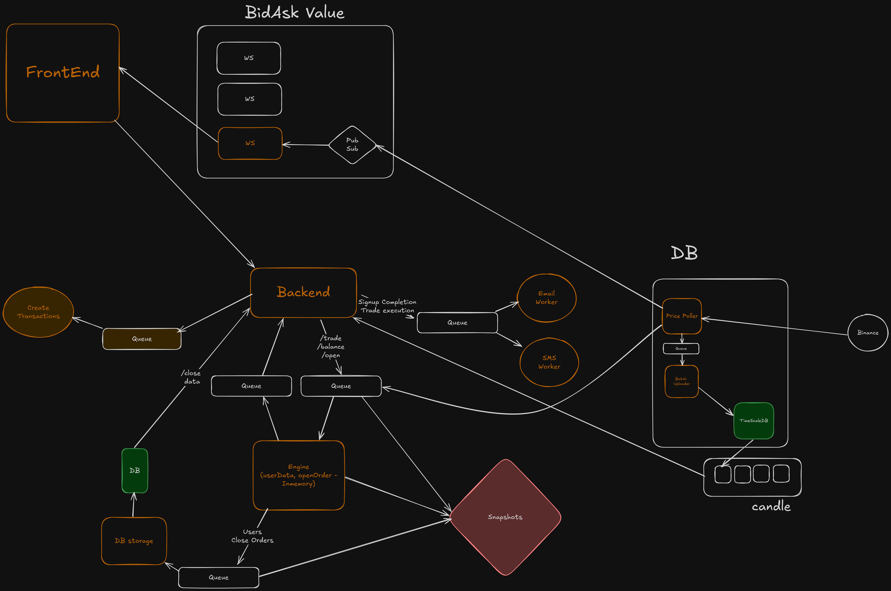

# Exness Trading Platform

A comprehensive cryptocurrency trading platform built with a microservices architecture, featuring real-time market data, order management, and user authentication.

## 🏗️ System Architecture



The platform follows a distributed microservices architecture with the following key components:

### Core Services

- **Frontend (Web)**: Next.js-based trading interface with real-time market data
- **Backend API**: Express.js REST API handling authentication, trading, and user management
- **Engine**: In-memory processing unit for high-performance order execution
- **WebSocket Server**: Real-time data distribution to frontend clients
- **Price Poller**: Fetches live market data from Binance WebSocket API
- **Database Storage**: Handles user data and transaction persistence
- **Batch Upload**: Processes and stores historical market data in TimeScaleDB

## 📦 Applications

### Frontend Applications

- **`web`**: Main trading platform frontend built with Next.js and Tailwind CSS
  - Real-time trading dashboard
  - User authentication and profile management
  - Market data visualization with TradingView charts
  - Order management interface

- **`docs`**: Documentation site for the platform
  - API documentation
  - User guides and tutorials
  - System architecture documentation

### Backend Services

- **`Backend`**: Core API server
  - RESTful API endpoints for trading operations
  - User authentication and authorization
  - Balance and asset management
  - Candle data for charting
  - Trade execution endpoints

- **`Engine`**: High-performance trading engine
  - In-memory order processing
  - Real-time trade execution
  - User data management
  - Order lifecycle management

- **`Websocket_Server`**: Real-time communication hub
  - WebSocket connections for live data
  - Redis Pub/Sub integration
  - Bid/Ask price distribution

- **`Price_Poller`**: Market data ingestion
  - Binance WebSocket integration
  - Real-time price processing
  - Bid/Ask calculation with spreads
  - Redis queue management

- **`DBstorage`**: Database operations service
  - User data persistence
  - Transaction logging
  - Order history management

- **`Batch_Upload`**: Historical data processing
  - TimeScaleDB integration
  - Batch data insertion
  - Candle data generation
  - Data compression and retention policies

## 📚 Shared Packages

### Core Packages

- **`@repo/config`**: Centralized configuration management
  - Environment variables
  - Redis connections (streams, pub/sub, client)
  - Database configurations
  - Stream constants and keys

- **`@repo/database`**: Database abstraction layer
  - Prisma ORM integration
  - Database client management
  - Type-safe database operations

- **`@repo/timescaledb`**: Time-series database integration
  - TimeScaleDB client wrapper
  - Hypertable management
  - Continuous aggregates for candles
  - Data compression and retention policies

- **`@repo/types`**: Shared TypeScript types
  - Price update interfaces
  - Trading data structures
  - API response types

### Utility Packages

- **`@repo/utils`**: Common utilities
  - Email notification system (Nodemailer)
  - Helper functions
  - Shared business logic

- **`@repo/ui`**: Reusable UI components
  - React components with Tailwind CSS
  - Trading interface components
  - Form elements and layouts

### Configuration Packages

- **`@repo/eslint-config`**: ESLint configurations
- **`@repo/typescript-config`**: TypeScript configurations
- **`@repo/tailwind-config`**: Tailwind CSS configuration
- **`@repo/typescript-config`**: Shared TypeScript settings

## 🚀 Getting Started

### Prerequisites

- Node.js 18+ or Bun
- Redis server
- PostgreSQL with TimeScaleDB extension
- Binance API access (for market data)

### Installation

```bash
# Install dependencies
bun install

# Set up environment variables
cp .env.example .env
# Edit .env with your configuration

# Start all services
bun run dev
```

### Development

```bash
# Start specific service
bun run dev --filter=backend
bun run dev --filter=web
bun run dev --filter=engine

# Build all packages
bun run build

# Run tests
bun run test
```

## 🔄 Data Flow

1. **Market Data Ingestion**: Price Poller fetches real-time data from Binance
2. **Data Processing**: Raw data is processed and stored in Redis queues
3. **Real-time Distribution**: WebSocket server distributes live prices to frontend
4. **Order Processing**: Backend receives trade requests and forwards to Engine
5. **Execution**: Engine processes orders in-memory for high performance
6. **Persistence**: Database services handle data storage and retrieval
7. **Historical Data**: Batch Upload processes and stores market data in TimeScaleDB

## 🛠️ Technology Stack

- **Frontend**: Next.js, React, Tailwind CSS, TradingView Charts
- **Backend**: Express.js, Node.js, TypeScript
- **Database**: PostgreSQL, TimeScaleDB, Prisma ORM
- **Caching**: Redis (Streams, Pub/Sub, Queues)
- **Real-time**: WebSockets, Redis Pub/Sub
- **Market Data**: Binance WebSocket API
- **Build Tool**: Turborepo, Bun
- **Deployment**: Docker-ready architecture

## 📊 Key Features

- **Real-time Trading**: Live market data and instant order execution
- **High Performance**: In-memory processing for sub-millisecond latency
- **Scalable Architecture**: Microservices with Redis for horizontal scaling
- **Time-series Data**: Optimized storage for historical market data
- **User Management**: Complete authentication and authorization system
- **Market Analysis**: Advanced charting with multiple timeframes
- **Risk Management**: Built-in order validation and balance checks

## 🔧 Configuration

The platform uses environment variables for configuration. Key settings include:

- Database connections (PostgreSQL, Redis)
- Binance API endpoints
- WebSocket ports and URLs
- Stream and queue names
- Security settings and CORS policies

## 📈 Performance Optimizations

- **In-memory Processing**: Engine service for ultra-fast order execution
- **Redis Streams**: Reliable message processing with backpressure handling
- **TimeScaleDB**: Optimized time-series data storage with compression
- **Continuous Aggregates**: Pre-computed candle data for fast chart loading
- **Connection Pooling**: Efficient database connection management
