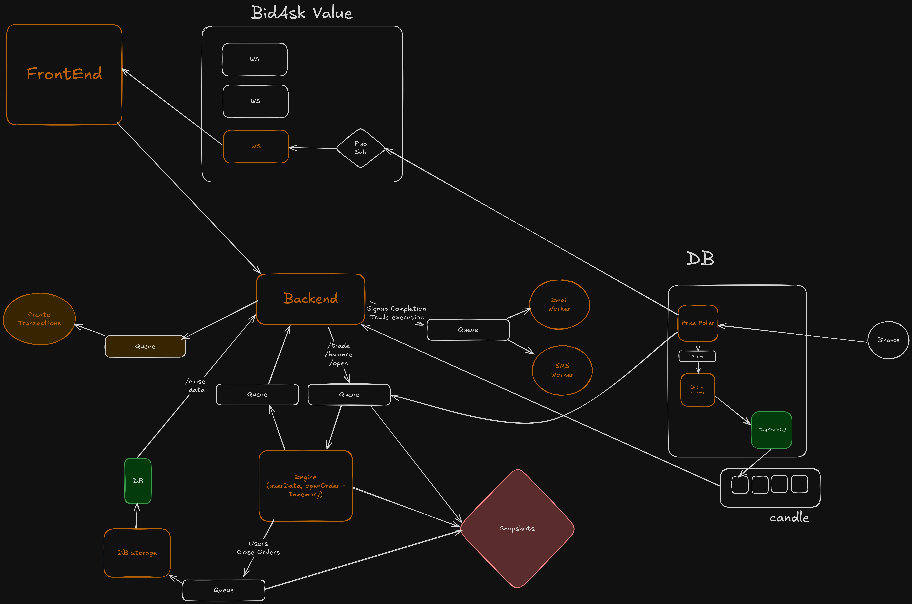
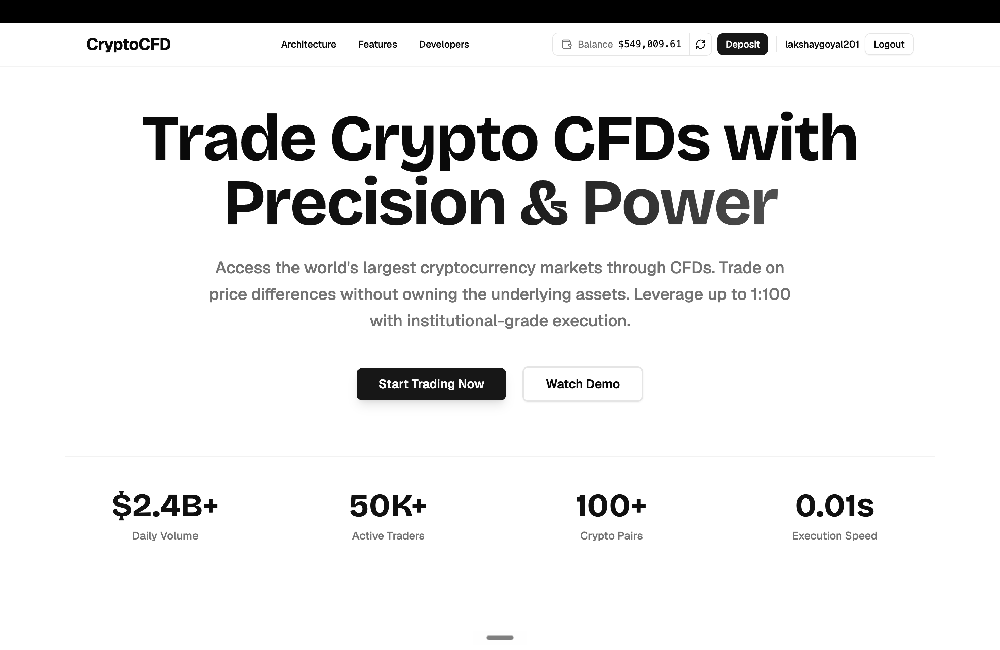
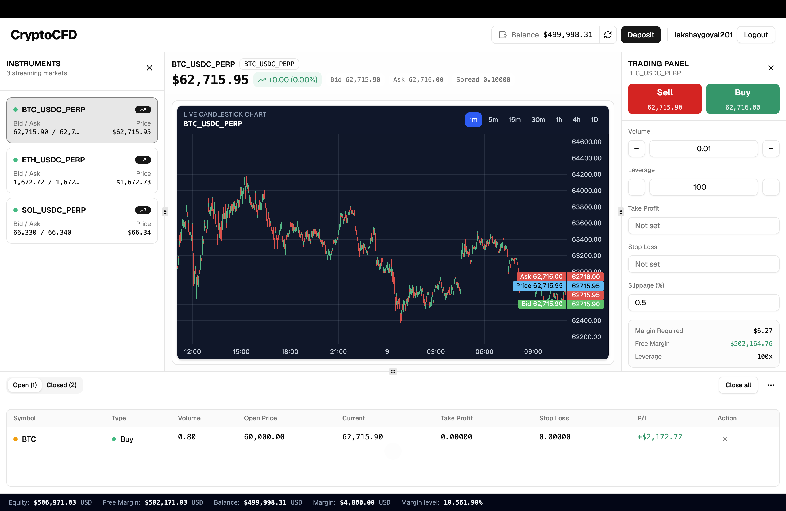
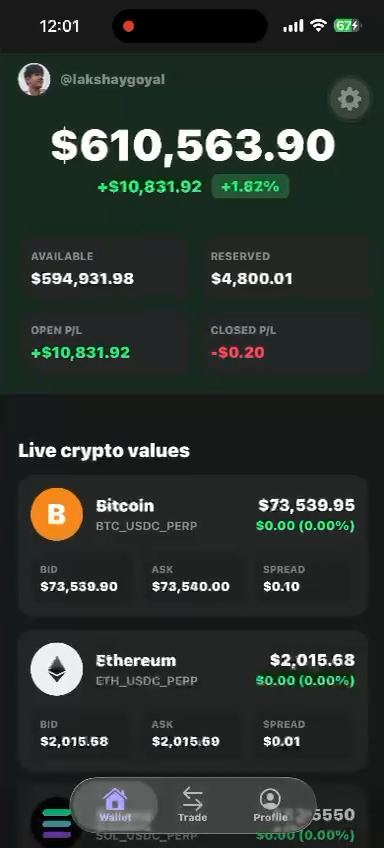
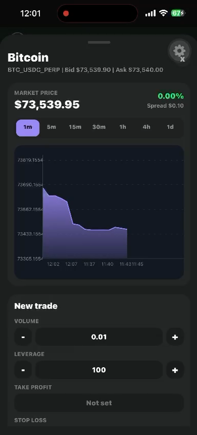

# Exness Trading Platform

A real-time cryptocurrency trading platform built as a Turborepo monorepo — web and mobile clients, an in-memory matching engine, Redis-stream-driven services, and a cost-first AWS deployment managed entirely by Terraform and GitHub Actions.

## 🏗️ System Architecture



**How data flows through the system:**

1. **Live market data** — web and mobile clients stream bid/ask prices directly from Binance bookTicker WebSockets
2. **Order placement** — the Backend API receives trade requests and forwards them to the Engine via Redis streams
3. **Execution** — the Engine processes orders entirely in-memory for sub-millisecond execution
4. **Risk monitoring** — the Engine subscribes to Binance bookTicker streams to trigger stop-loss / take-profit
5. **Persistence** — DBstorage consumes engine events and writes them to PostgreSQL; Snap-shotting periodically persists engine state to MongoDB for crash recovery
6. **Historical data** — candle/chart data is fetched on-demand from the Binance Kline API

## 🖥️ Web UI

<p align="center">
  
  
</p>

## 📱 Mobile UI

<p align="center">
  
  
  
</p>

## 🎥 Demo Video

<table>
  <tr>
    <th>Web demo</th>
    <th>Mobile demo</th>
  </tr>
  <tr>
    <td width="50%">
      <video src="https://raw.githubusercontent.com/lakshay-goyal/Exness-Kline/main/packages/assets/video/ExnessWeb.mp4" controls width="100%"></video>
    </td>
    <td width="50%">
      <video src="https://raw.githubusercontent.com/lakshay-goyal/Exness-Kline/main/packages/assets/video/ExnessMobile.mp4" controls width="100%"></video>
    </td>
  </tr>
</table>

<!--
The <video> players above stream the files from raw.githubusercontent.com.
If a player ever shows blank (raw media is rate-limited / CSP-blocked),
the bulletproof fix is to edit this README in the GitHub web editor, drag
each .mp4 into the cell, and swap the src for the generated
user-attachments.githubusercontent.com URL.
-->

Direct links: [web demo](packages/assets/video/ExnessWeb.mp4) · [mobile demo](packages/assets/video/ExnessMobile.mp4)

## 📦 What's Inside

### Applications

| App | Path | Description | Port |
| --- | --- | --- | --- |
| **Web** | `apps/web` | Next.js trading frontend — TradingView-style charts, live order book, order management | 3001 |
| **Mobile** | `apps/mobile` | Expo (React Native) trading app, shipped via EAS (outside the AWS pipeline) | — |
| **Backend** | `apps/Backend` | Express REST API — auth (JWT + Google OAuth via better-auth), balances, trades, candles | 8000 |
| **Engine** | `apps/Engine` | In-memory order execution, SL/TP monitoring via Binance bookTicker | — |
| **DBstorage** | `apps/DBstorage` | Consumes Redis streams, persists users/orders to PostgreSQL via Prisma | — |
| **Snap-shotting** | `apps/snap-shotting` | Periodic engine state snapshots to MongoDB for recovery | — |
| **Docs** | `apps/docs` | Next.js documentation site | 3000 |

### Web pages

- `/` — landing page
- `/login` — authentication (email + Google OAuth)
- `/dashboard` — trading dashboard: live charts, bid/ask, open/closed orders, balance

### Mobile screens

- **Trade** — live market list and order placement
- **Crypto detail** (`crypto/[symbol]`) — per-symbol chart and trading
- **Wallet** — balances and history
- **Profile** — account management

### Shared packages

| Package | Purpose |
| --- | --- |
| `@repo/config` | Env config, Redis clients/streams, stream constants |
| `@repo/types` | Shared DTOs, Redis command/response shapes, symbols & intervals |
| `@repo/trading-core` | Trading domain logic — margin, P/L, TP/SL math, validation |
| `@repo/api-client` | Platform-neutral backend client shared by web and mobile |
| `@repo/db` | Prisma ORM client and migrations |
| `@repo/ui` | Shared React components (Tailwind) |
| `@repo/utils` | Email notifications (Nodemailer), helpers |
| `@repo/eslint-config`, `@repo/typescript-config`, `@repo/tailwind-config` | Shared tooling configs |

## 🚀 Getting Started

### Prerequisites

- [Bun](https://bun.sh) ≥ 1.2
- Docker + Docker Compose
- Node.js ≥ 18 (for tooling)

Clone and configure:

```bash
git clone <your-fork-url>
cd Exness
bun install

cp .env.example .env
# Edit .env — at minimum JWT_SECRET, BETTER_AUTH_SECRET,
# GOOGLE_CLIENT_ID/SECRET (OAuth), USER_EMAIL/USER_PASSWORD (email notifications)
```

### Option 1 — Manual setup (local dev)

Run only the databases in Docker; run all services on the host with hot reload:

```bash
# 1. Start PostgreSQL (host port 5434), Redis (6379), MongoDB (27017)
docker compose up -d postgres redis mongodb

# 2. Apply database migrations and generate the Prisma client
cd packages/db
bun run db:migrate
bun run db:generate
cd ../..

# 3. Start everything (Turborepo)
bun run dev

# ...or individual services
bun run dev --filter=web
bun run dev --filter=backend
bun run dev --filter=engine
```

Useful extras:

```bash
bun run db:studio      # Prisma Studio
bun run check-types    # typecheck all packages
bun run build          # build all packages
```

### Option 2 — Docker (full stack)

Everything — all six services plus PostgreSQL, Redis, and MongoDB — runs in Compose. Migrations run automatically via the `db-migrate` one-shot container.

```bash
# Generate per-service env files (apps/docker/env/*) from the root .env
bun run sync:docker-env

# Build and start the full stack
docker compose up -d --build
```

| Service | URL |
| --- | --- |
| Web app | http://localhost:3001 |
| Backend API | http://localhost:8000 |
| Docs | http://localhost:3000 |
| Prisma Studio | http://localhost:5555 |

For Docker-based development with hot reload (bind-mounted source + `bun --watch`, no image rebuilds):

```bash
bun run docker:sync   # applies the docker-compose.dev.yml overlay
```

### Option 3 — Production (AWS)

Production is fully automated: **every push to `main` deploys** via GitHub Actions (`.github/workflows/deploy.yml`). No manual server work.

```
push to main (apps/mobile/** ignored)
  → checks: turbo check-types + build  --filter='!mobile'
  → terraform apply (infra/aws)        → ECR, VPC, EC2 + Elastic IP, SSM params, S3
  → docker build & push ×6             → ECR, tagged <git-sha> + latest
  → SSM Run Command on the instance    → deploy.sh: fetch secrets, pull images, compose up
  → job summary                        → prints live service URLs
```

The whole stack runs as Docker Compose on a **single EC2 instance** (cost-first: ~$35/mo vs $300+/mo for the managed-services equivalent). Key choices:

- **No SSH / key pairs** — shell access via SSM Session Manager, deploys via SSM Run Command
- **GitHub OIDC** — no long-lived AWS keys stored in GitHub
- **Secrets in SSM Parameter Store** (SecureString) — never in Terraform outputs or CI logs
- **Pull requests** run checks + `terraform plan` only; nothing is applied

See [`infra/README.md`](infra/README.md) for day-2 operations (shell access, rollbacks, teardown) and trade-offs.

## 🍴 Forked the repo? One-time AWS setup

If you fork this repo and want your own deployment, you need to bootstrap AWS **once, locally**, then the pipeline takes over.

**You need locally:** [Terraform](https://developer.hashicorp.com/terraform/install) ≥ 1.5, AWS CLI configured with **admin credentials** (`aws configure`).

**1. Bootstrap the Terraform state bucket + GitHub OIDC role (run locally):**

```bash
cd infra/bootstrap
terraform init
terraform apply -var "github_repository=<your-github-username>/<your-fork-name>"
```

Note the two outputs: `tf_state_bucket` and `github_deploy_role_arn`. This is the **only** Terraform you ever run by hand — the main stack (`infra/aws`) is applied by CI.

**2. Add GitHub repository secrets** (your fork → Settings → Secrets and variables → Actions):

| Secret | Value |
| --- | --- |
| `AWS_ROLE_ARN` | `github_deploy_role_arn` output from step 1 |
| `TF_STATE_BUCKET` | `tf_state_bucket` output from step 1 |
| `JWT_SECRET` | any strong random string |
| `BETTER_AUTH_SECRET` | `openssl rand -base64 32` |
| `GOOGLE_CLIENT_ID` | your Google OAuth client ID |
| `GOOGLE_CLIENT_SECRET` | your Google OAuth client secret |
| `USER_EMAIL` | nodemailer sender address |
| `USER_PASSWORD` | nodemailer app password |

Optional repository **variable**: `AWS_REGION` (defaults to `ap-south-1`). The EC2 instance type and other knobs live in [`infra/aws/variables.tf`](infra/aws/variables.tf).

**3. Push to `main`.** The pipeline provisions everything and prints your service URLs in the workflow run summary:

- Web app → `http://<elastic-ip>:3001`
- Backend API → `http://<elastic-ip>:8000`
- Docs → `http://<elastic-ip>:3000`

Database passwords are generated by Terraform and stored only in SSM Parameter Store — you never set or see them.

## 🛠️ Technology Stack

- **Frontend**: Next.js, React, Tailwind CSS, lightweight-charts
- **Mobile**: Expo (React Native), NativeWind
- **Backend**: Express 5, TypeScript, better-auth (JWT + Google OAuth)
- **Databases**: PostgreSQL (Prisma ORM), MongoDB (snapshots), Redis Streams (messaging)
- **Market data**: Binance WebSocket bookTicker + Kline REST API
- **Monorepo**: Turborepo + Bun workspaces
- **Infrastructure**: Terraform, AWS (EC2, ECR, SSM, S3), Docker Compose
- **CI/CD**: GitHub Actions with OIDC — push-to-deploy
